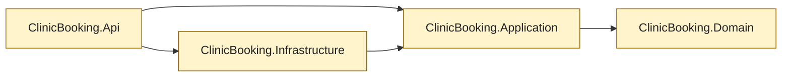
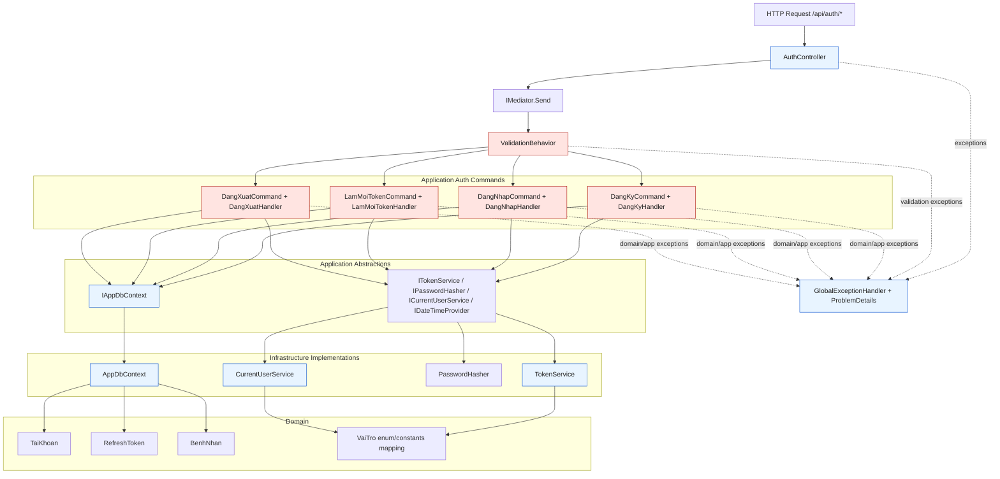
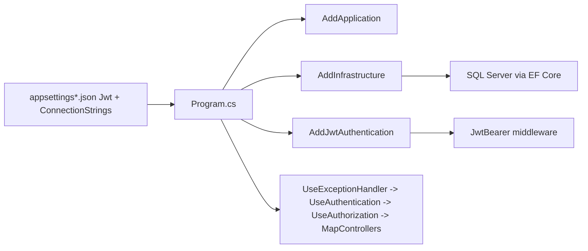

# Code Review Graph

This graph is tailored to the current codebase and highlights dependency direction, runtime request flow, and high-risk review checkpoints.

## 1) Project Dependency Graph (Static)

Review focus:
- Ensure dependency direction remains inward-only toward Domain.
- Prevent business rules in API and Infrastructure layers.

## 2) Runtime Auth Flow Graph (CQRS)

Review focus:
- Validation order and completeness in validators.
- Authorization and ownership checks in `DangXuatHandler`.
- Refresh token rotation and replay handling in `LamMoiTokenHandler`.
- Transaction boundaries and persistence consistency around token issuance.
- ProblemDetails mapping correctness and leakage-safe error details.

## 3) Build/Config Flow Graph

Review focus:
- Required configuration keys are validated at startup.
- Authentication/authorization middleware order remains correct.
- DB provider and migration compatibility remain aligned with runtime environment.

## Suggested Review Order

1. API entrypoints (`Program.cs`, controllers, middleware wiring).
2. Application pipeline (`ValidationBehavior`, command handlers, validators).
3. Security-critical infrastructure (`TokenService`, `CurrentUserService`).
4. Persistence contracts and EF implementation (`IAppDbContext`, `AppDbContext`).
5. Domain entities/enums affected by reviewed feature.
